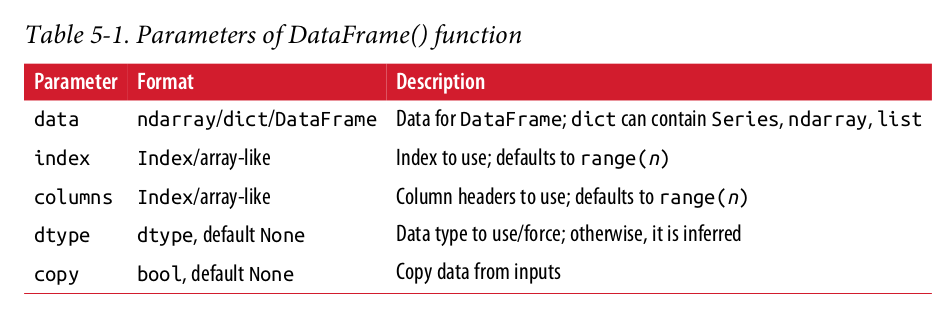
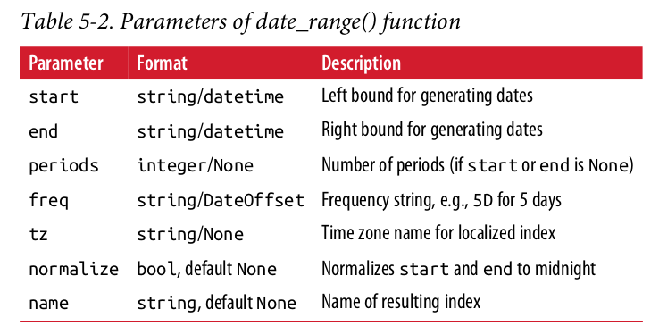
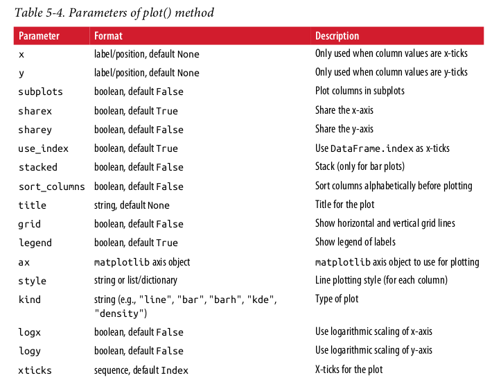
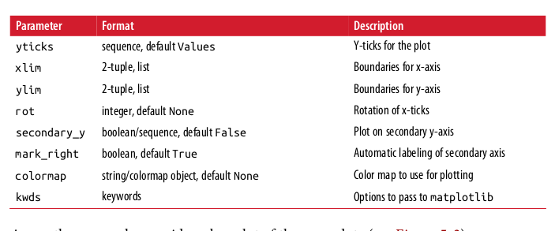

# Chapter 5 Notes

## The DataFrame Class
The DataFrame class is designed to manage indexed and
labeled data, not too different from a SQL database table or a worksheet in a spread‐
sheet application

Although one can construct DataFrame objects directly, using
a ndarray object is generally a good choice since pandas will retain the basic struc‐
ture and will “only” add metainformation (e.g., index values). It also represents a typ‐
ical use case for financial applications and scientific research in general.

## DatetimeIndex
To work with financial time series data efficiently, one must be able to handle time
indices well. This can also be considered a major strength of pandas

## Basic Visualisation

