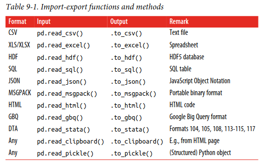

# Chapter 9 Notes

### Pandas I/O
Pandas already have functions to load different types of data

### Using compressed arrays
The examples show that there is hardly any speed difference when working with
compressed Table objects as compared to uncompressed ones. However, file sizes on
disk might—depending on the quality of the data—be significantly reduced, which
has a number of benefits:
- Storage costs are reduced.
- Backup costs are reduced.
- Network traffic is reduced.
- Network speed is improved (storage on and retrieval from remote servers is
faster).
- CPU utilization is increased to overcome I/O bottlenecks.